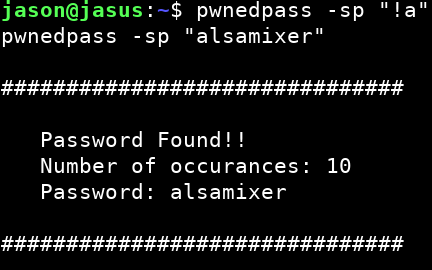

# pwnedpass

**Perl script to perform online password testing against pwnedpasswords.com**

This is the first Perl script that I've ever written. I wrote it as a way to see what this language is all about. And... If I'm being honest... To avoid working on a project for my DSP class.

> SYNOPSIS
>    pwnedpass [OPTIONS] -p PASSWORD
> 
> DESCRIPTION
> This script checks a provided plaintext password against 
> Troy Hunt's pwnedpasswords service. It computes the sha1 hash 
> of the password and separates the hash into prefix and suffix. 
> The suffix is the first five characters of the hash, and it is 
> sent to the server via HTTP GET request. The server replies 
> with the suffix and occurance count for every hash in its 
> database that begins with the same suffix. In this way, your 
> password remains secure. 
> 
>    Usage:
> 
>       -h
>          Optional. Show this help.
> 
>       -s
>          Optional. Show plaintext password in result
>          (useful for scripting).
> 
>       -v 
>          Optional. Dump variables when match is found.
> 
>       -p PASSWORD
>          Required. Password to test.
> 

See it go:

TO DO:
* Change -p behavior. 
  - Currently, plaintext passwords get stored in the terminal's command history. The -p argument should be optional and used for scripting only. If -p is not provided, the user should be prompted for a password.
* Uh. Special characters need some work.
  - How did I not catch this?
  - 
