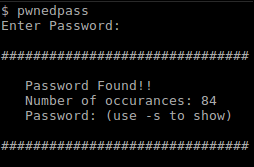
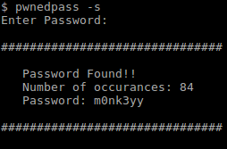
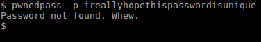

# pwnedpass

**Perl script to perform online password testing against pwnedpasswords.com**

This is the first Perl script that I've ever written. I wrote it as a way to see what this language is all about. And... If I'm being honest... To avoid working on a project for my DSP class.

> SYNOPSIS
>    pwnedpass [OPTIONS]
> 
> DESCRIPTION
> This script checks a provided plaintext password against 
> Troy Hunt's pwnedpasswords service. It computes the sha1 hash 
> of the password and separates the hash into prefix and suffix. 
> The suffix is the first five characters of the hash, and it is 
> sent to the server via HTTP GET request. The server replies 
> with the suffix and occurance count for every hash in its 
> database that begins with the same suffix. In this way, your 
> password remains secure. 
> 
>    Usage:
> 
>       -h
>          Optional. Show this help.
> 
>       -s
>          Optional. Show plaintext password in result
>          (useful for scripting).
> 
>       -v 
>          Optional. Dump variables.
> 
>       -p PASSWORD
>          Optional. Password to test. You need to adhere to 
>          your shell's special character handling. BASH, for 
>          example has all kinds of rules. Search its man page 
>          for the word "mechanisms" to find the relevant 
>          section. You can usually get away with using single 
>          quotes around the password. **THIS IS MEANT TO BE CALLED 
>          FROM A SCRIPT** Using this switch directly from your 
>          terminal means your plaintext password will be saved in 
>          your command history file.

See it go:

  
